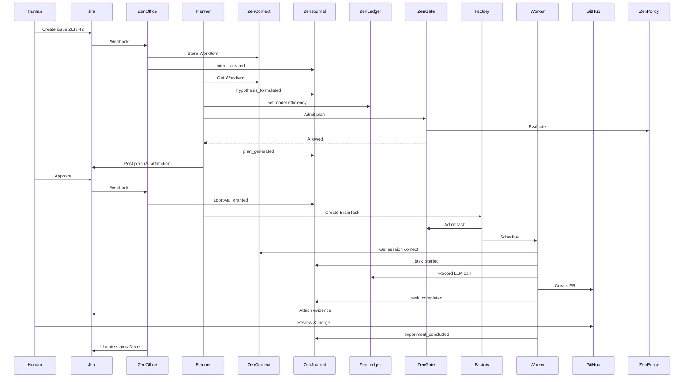

# Workflow Examples

This document illustrates typical workflows through Zen‑Brain, showing how components interact to accomplish tasks.

## Example 1: Implement a Feature Request (Jira → PR)

**Scenario:** A human creates a Jira issue requesting a new feature. Zen‑Brain analyzes the request, plans the implementation, writes code, tests it, and creates a pull request.

### Actors

- **Human** – creates Jira issue, reviews plan, approves PR.
- **Jira** – issue tracking system.
- **ZenOffice (Jira connector)** – maps Jira issue to canonical WorkItem.
- **Planner Agent** – analyzes intent, creates execution plan.
- **Worker Agent** – executes implementation tasks.
- **Factory** – schedules and manages worker pods.
- **GitHub** – hosts source code, receives PR.

### Steps

1. **Human creates Jira issue** (`ZEN‑42: Add rate limiting to API gateway`)
   - Fields: Summary, Description, Component: `api‑gateway`, Labels: `feature`, `backend`.
   - Custom field `KB Scope`: `api‑gateway`, `rate‑limiting`.

2. **Jira connector detects new issue** (webhook)
   - Fetches issue details via Jira REST API.
   - Maps Jira fields to canonical `WorkItem`:
     - `WorkType`: `implementation`
     - `WorkDomain`: `core`
     - `Priority`: `medium`
     - `KBScopes`: [`api‑gateway`, `rate‑limiting`]
   - Stores `WorkItem` in ZenContext (Tier 1).
   - Records `intent_created` event in ZenJournal.

3. **Planner Agent picks up the WorkItem**
   - Retrieves relevant knowledge from QMD using `KBScopes`.
   - Analyzes intent, formulates hypothesis (SR&ED event `hypothesis_formulated`).
   - Creates execution plan (breakdown into subtasks: research, design, implement, test).
   - Selects optimal LLM model based on ZenLedger efficiency data.
   - Records `plan_generated` event.
   - Updates Jira issue with plan (injects AI attribution header).

4. **Human approves the plan** (via Jira comment)
   - Jira connector records `approval_granted` event.
   - WorkItem status changes to `approved`.

5. **Factory schedules subtasks**
   - Creates `BrainTask` CRDs for each subtask.
   - ZenGate validates each task (budget, policy).
   - Session Affinity Dispatcher assigns tasks to a warm worker in the appropriate cluster.

6. **Worker Agent executes implementation**
   - Worker pod already has model loaded (warm pool).
   - Creates git worktree (`/factory/worktrees/wt‑zen‑42‑impl`).
   - Queries QMD for rate‑limiting patterns, existing API gateway code.
   - Writes code, runs tests, commits changes.
   - Records `action_executed` events with SR&ED tags.
   - Updates ZenContext with session state.
   - Calls ZenLedger after each LLM call (token usage).

7. **Worker completes subtasks**
   - Creates pull request on GitHub.
   - Attaches evidence (code diff, test results) to Jira issue.
   - Records `task_completed` event.

8. **Human reviews PR**
   - If changes requested, Worker iterates (back to step 6).
   - If approved, PR is merged.
   - Worker records `experiment_concluded` event (SR&ED).

9. **Jira issue updated**
   - Status set to `Done`.
   - All AI‑generated comments include attribution headers.

### SR&ED Evidence Collected

- `hypothesis_formulated` – uncertainty about optimal rate‑limiting algorithm.
- `approach_attempted` – multiple algorithm implementations tried.
- `result_observed` – performance metrics for each algorithm.
- `experiment_concluded` – final algorithm selected with rationale.
- Token usage records (ZenLedger) tagged as SR&ED‑eligible.
- Code diffs, test results stored in Evidence Vault.

## Example 2: Debug a Production Incident

**Scenario:** A monitoring alert triggers a Jira incident ticket. Zen‑Brain diagnoses the problem, suggests a fix, and applies it after approval.

### Steps

1. **Alert → Jira incident** (`ZEN‑INC‑101: API latency spike`).
2. **Planner retrieves relevant runbooks** from QMD (scope: `incident‑response`, `api‑gateway`).
3. **Worker analyzes logs, metrics** (querying observability stack).
4. **Worker identifies root cause** (misconfigured cache timeout).
5. **Planner generates fix plan**, requires approval due to production impact.
6. **Human approves** (via Slack integration).
7. **Worker applies configuration change**, verifies latency improvement.
8. **Incident closed**, post‑mortem added to knowledge base.

## Example 3: Document a New Process

**Scenario:** A team lead requests documentation for the deployment process.

1. **Jira issue** (`ZEN‑DOC‑15: Document staging deployment`).
2. **Planner searches QMD** for existing deployment docs.
3. **Worker examines code** (CI/CD pipelines, deployment scripts).
4. **Worker writes markdown documentation**, adds to `zen‑docs`.
5. **KB Ingestion Service indexes** new doc, syncs to Confluence.
6. **Jira issue linked** to new Confluence page.

## Cross‑Component Interaction Map

| Step | Office | Context | Journal | Ledger | Gate | Policy | Factory | KB/QMD |
|------|--------|---------|---------|--------|------|--------|---------|--------|
| Intent capture | ✅ | ✅ | ✅ | | | | | |
| Intent analysis | | ✅ | ✅ | ✅ | ✅ | ✅ | | ✅ |
| Planning | | ✅ | ✅ | ✅ | ✅ | ✅ | | ✅ |
| Execution | | ✅ | ✅ | ✅ | ✅ | ✅ | ✅ | ✅ |
| Evidence collection | | ✅ | ✅ | ✅ | | | ✅ | |
| Status update | ✅ | ✅ | ✅ | | | | | |

## Visual Flow (Mermaid)

---

*These examples are illustrative; actual workflows may vary based on configuration and component maturity.*